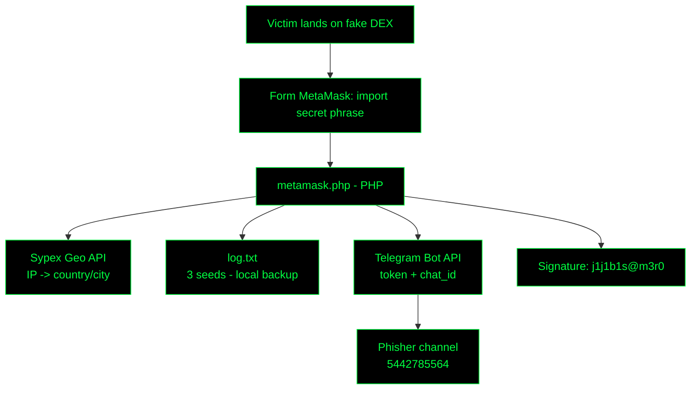

<div align="center">


<br/>


</div>

---

## `> whoami`

```bash
analyst@soc:~$ cat case_file.txt
[CASE]     GrabThePhisher — Blue Team CTF (CyberDefenders)
[TYPE]     Phishing kit hosted on a compromised server
[LURE]     Fake DEX -> "restore access" to wallet
[GOAL]     Steal MetaMask seed phrases (12/24 words)
[EXFIL]    Telegram Bot API (real time) + log.txt (local backup)
[OUTPUT]   IOCs + actor profile (alias, token, chat_id)
```

---

## `> ./runbook.sh --steps`

> Format: **command → finding → pivot**. Each step unlocks the next one.

```text
┌─[ STEP 1 ]─[ KIT RECON ]─────────────────────────────────────────────────────┐
│                                                                              │
│  WHO   : SOC / DFIR analyst                                                  │
│  WHAT  : Phishing kit structure                                              │
│  WHY   : Identify the spoofed brand/wallet                                   │
│                                                                              │
│  $ unzip GrabThePhisher.zip -d kit && cd kit                                 │
│  $ tree -a .                                                                 │
│                                                                              │
│  [+] Directory /metamask/  -> target = MetaMask (Q1)                         │
│                                                                              │
│  PIVOT: Target wallet -> find the kit backend                                │
└──────────────────────────────────────────────────────────────────────────────┘

┌─[ STEP 2 ]─[ KIT SOURCE ]────────────────────────────────────────────────────┐
│                                                                              │
│  WHO   : Server-side backend                                                 │
│  WHAT  : File that processes the form                                        │
│  WHY   : Holds the theft/exfil logic                                         │
│                                                                              │
│  $ find . -type f -name '*.php'                                              │
│  $ head -n 20 metamask/metamask.php                                          │
│                                                                              │
│  [+] metamask.php (Q2)  |  Language: PHP (Q3)                                │
│                                                                              │
│  PIVOT: Read metamask.php -> APIs and sinks                                  │
└──────────────────────────────────────────────────────────────────────────────┘

┌─[ STEP 3 ]─[ ENRICHMENT ]────────────────────────────────────────────────────┐
│                                                                              │
│  WHO   : IP geolocation API                                                  │
│  WHAT  : Service that profiles the victim                                    │
│  WHY   : Attacker adds country/region/city                                   │
│                                                                              │
│  $ grep -niE 'geo|REMOTE_ADDR|http' metamask/metamask.php                    │
│                                                                              │
│  [+] api.sypexgeo.net -> Sypex Geo (Q4)                                      │
│                                                                              │
│  PIVOT: Victim data + seed -> where does it go?                              │
└──────────────────────────────────────────────────────────────────────────────┘

┌─[ STEP 4 ]─[ LOCAL LOOT ]────────────────────────────────────────────────────┐
│                                                                              │
│  WHO   : Log file on the server                                              │
│  WHAT  : Seeds already captured                                              │
│  WHY   : Measure impact = # of victims                                       │
│                                                                              │
│  $ wc -l metamask/log.txt && cat metamask/log.txt                            │
│  $ tail -n 1 metamask/log.txt                                                │
│                                                                              │
│  [+] 3 seed phrases (Q5)                                                     │
│  [+] Latest = 'father also recycle ... hockey' (Q6)                          │
│                                                                              │
│  PIVOT: Log is a backup -> find remote channel                               │
└──────────────────────────────────────────────────────────────────────────────┘

┌─[ STEP 5 ]─[ EXFIL CHANNELS ]────────────────────────────────────────────────┐
│                                                                              │
│  WHO   : Data sinks in the script                                            │
│  WHAT  : Credential dumping methods                                          │
│  WHY   : Redundancy: local + real time                                       │
│                                                                              │
│  $ grep -nE 'fopen|fwrite|file_put|api.telegram' metamask.php                │
│                                                                              │
│  [+] log.txt + Telegram bot (Q7)                                             │
│                                                                              │
│  PIVOT: Telegram -> extract bot credentials                                  │
└──────────────────────────────────────────────────────────────────────────────┘

┌─[ STEP 6 ]─[ BOT CREDS ]─────────────────────────────────────────────────────┐
│                                                                              │
│  WHO   : Telegram Bot API                                                    │
│  WHAT  : Hardcoded token + chat_id                                           │
│  WHY   : Strong IOC, pivot to attacker infra                                 │
│                                                                              │
│  $ grep -nE 'token|chat_id|bot[0-9]' metamask/metamask.php                   │
│                                                                              │
│  [+] token   = 5457463144:AAG8t4k7e2ew3tTi0IBShcWbSia0Irvxm10 (Q8)           │
│  [+] chat_id = 5442785564 (Q9)                                               │
│                                                                              │
│  PIVOT: Token -> getMe / getChat (Bot API)                                   │
└──────────────────────────────────────────────────────────────────────────────┘

┌─[ STEP 7 ]─[ ATTRIBUTION ]───────────────────────────────────────────────────┐
│                                                                              │
│  WHO   : Signature/credits in the code                                       │
│  WHAT  : Developer alias                                                     │
│  WHY   : CTI profile, links to other campaigns                               │
│                                                                              │
│  $ grep -niE '@|author|coded|by ' metamask/metamask.php                      │
│                                                                              │
│  [+] Alias = j1j1b1s@m3r0 (Q10)                                              │
│                                                                              │
│  PIVOT: Alias -> OSINT on forums / Telegram                                  │
└──────────────────────────────────────────────────────────────────────────────┘
```

---

## `> ./run_investigation.sh --answers`

<details>
<summary><b>[Q1]</b> Wallet used to ask for the seed phrase</summary>

```bash
[+] ANSWER: MetaMask
```
> Kit directory <code>/metamask/</code>; fake "Import account secret phrase" form.

**How to get there:** Unzip the lab and list the tree. The kit has a folder named after the wallet it spoofs; the HTML form inside it asks for the secret phrase.

```bash
$ unzip GrabThePhisher.zip -d kit && cd kit   # extract the lab
$ tree -a .                                    # full structure -> metamask/
$ ls -la metamask/                             # files inside the kit folder
$ grep -rni 'secret phrase' .                  # confirm the lure text
```

</details>

<details>
<summary><b>[Q2]</b> File containing the kit code</summary>

```bash
[+] ANSWER: metamask.php
```
> Server-side script that receives the form and exfiltrates the data.

**How to get there:** Look for server-side scripts inside <code>metamask/</code>; the HTML form's <code>action=</code> points to the file that processes the input.

```bash
$ find . -type f -name '*.php'                 # list server-side scripts
$ grep -rn 'action=' --include=*.html .        # form -> backend file
$ cat metamask/metamask.php | less             # read the kit logic
```

</details>

<details>
<summary><b>[Q3]</b> Language the kit was written in</summary>

```bash
[+] ANSWER: PHP
```
> <code>.php</code> extension; runs server-side, easy to deploy on compromised hosting.

**How to get there:** Check the file type and the opening tag of <code>metamask.php</code>.

```bash
$ file metamask/metamask.php                   # -> PHP script text
$ head -n 5 metamask/metamask.php              # starts with <?php
```

</details>

<details>
<summary><b>[Q4]</b> Service used to get victim machine info</summary>

```bash
[+] ANSWER: Sypex Geo
```
> Sends <code>$_SERVER['REMOTE_ADDR']</code> to the API and gets country/region/city.

**How to get there:** Inside <code>metamask.php</code>, search for outbound HTTP calls and the victim IP variable; the geo API URL sits next to them.

```bash
$ grep -niE 'geo|REMOTE_ADDR' metamask/metamask.php      # IP + geo lookup
$ grep -noE 'https?://[^ \x27]+' metamask/metamask.php  # every URL -> api.sypexgeo.net
```

</details>

<details>
<summary><b>[Q5]</b> Seed phrases already collected</summary>

```bash
[+] ANSWER: 3
```
> 3 entries in <code>log.txt</code> = 3 victims.

**How to get there:** The script writes every capture to a local file. Find it with <code>find</code>, then count its entries.

```bash
$ find . -name '*.txt'                         # -> metamask/log.txt
$ grep -n 'log.txt' metamask/metamask.php      # confirm the script writes there
$ cat metamask/log.txt                         # view entries
$ grep -c . metamask/log.txt                   # count non-empty lines -> 3
```

</details>

<details>
<summary><b>[Q6]</b> Seed phrase from the most recent incident</summary>

```bash
[+] ANSWER: father also recycle embody balance concert mechanic believe owner pair muffin hockey
```
> Last line of <code>log.txt</code>.

**How to get there:** Entries are appended, so the newest one is at the bottom of <code>log.txt</code>.

```bash
$ tail -n 1 metamask/log.txt                   # newest entry
$ tail -n 1 metamask/log.txt | wc -w           # 12 words = valid seed
```

</details>

<details>
<summary><b>[Q7]</b> Medium used for credential dumping</summary>

```bash
[+] ANSWER: Telegram (+ local log.txt)
```
> Real-time exfil via the Bot API + local backup copy.

**How to get there:** Search <code>metamask.php</code> for data sinks: file writes (local log) and HTTP calls to the Telegram Bot API (remote exfil).

```bash
$ grep -nE 'fopen|fwrite|file_put_contents' metamask/metamask.php   # local dump
$ grep -n 'api.telegram.org' metamask/metamask.php                  # Telegram exfil
```

</details>

<details>
<summary><b>[Q8]</b> Channel token</summary>

```bash
[+] ANSWER: 5457463144:AAG8t4k7e2ew3tTi0IBShcWbSia0Irvxm10
```
> Bot credential hardcoded in the script.

**How to get there:** Telegram tokens follow the format <code>&lt;digits&gt;:&lt;35 chars&gt;</code>; grep the variable or the pattern.

```bash
$ grep -ni 'token' metamask/metamask.php
$ grep -oE '[0-9]{8,10}:[A-Za-z0-9_-]{35}' metamask/metamask.php   # regex for bot tokens
```

</details>

<details>
<summary><b>[Q9]</b> Phisher's chat ID</summary>

```bash
[+] ANSWER: 5442785564
```
> Destination of the messages carrying stolen seeds.

**How to get there:** The <code>chat_id</code> is defined next to the token and used in the <code>sendMessage</code> call.

```bash
$ grep -ni 'chat_id' metamask/metamask.php
$ grep -n 'sendMessage' metamask/metamask.php  # where token + chat_id are used
```

</details>

<details>
<summary><b>[Q10]</b> Phishing kit developer's alias</summary>

```bash
[+] ANSWER: j1j1b1s@m3r0
```
> Signature/credits inside the code.

**How to get there:** Kit authors leave credits in comments; search comments and <code>@</code> handles.

```bash
$ grep -nE '^\s*(//|#|/\*|\*)' metamask/metamask.php   # comments only
$ grep -n '@' metamask/metamask.php            # handles/aliases -> j1j1b1s@m3r0
```

</details>


---

## `> cat attack_flow.mmd`



---

## `> cat iocs.csv`

| Type | Value | Context |
|:--|:--|:--|
| `file` | `metamask.php` | Phishing kit backend |
| `file` | `log.txt` | Local loot (seed phrases) |
| `url` | `api.telegram.org/bot5457463144:...` | Exfiltration channel |
| `token` | `5457463144:AAG8t4k7e2ew3tTi0IBShcWbSia0Irvxm10` | Telegram Bot token |
| `chat_id` | `5442785564` | Phisher channel |
| `service` | `Sypex Geo` | Victim geolocation |
| `alias` | `j1j1b1s@m3r0` | Kit developer |

---

## `> cat mitre.map`

| Tactic | Technique | Evidence |
|:--|:--|:--|
| Initial Access | `T1566` Phishing | Fake DEX/MetaMask page |
| Collection | `T1056.003` Web Portal Capture | Seed phrase form |
| Collection | `T1074.001` Local Data Staging | `log.txt` on the server |
| Exfiltration | `T1567` Exfil Over Web Service | Telegram Bot API |

---

## `> cat detect_and_mitigate.sh`

```bash
# HUNT  — outbound traffic from the web server to the Bot API
grep -r "api.telegram.org/bot" /var/www/            # kits on your own hosting
# HUNT  — PHP with exfil sinks + geo
grep -rlE "sypexgeo|chat_id|file_put_contents" /var/www/ --include=*.php
# BLOCK — egress to api.telegram.org from web servers (proxy/FW)
# REPORT — bot token to Telegram (abuse) and domain to hosting/registrar
# USER  — no legitimate site ever asks for your seed phrase. Ever.
```

---

## `> cat lessons.txt`

- **Kits = cleartext evidence:** token, chat_id and alias are usually hardcoded → direct IOCs.
- **Dual exfil:** always look for the remote channel **and** the local log (attacker redundancy).
- **Legitimate services abused:** Telegram / Sypex Geo — the same API lets the analyst pivot.

<details>
<summary><b>> cat sources.log</b></summary>

- [CyberDefenders — GrabThePhisher Lab](https://cyberdefenders.org/blueteam-ctf-challenges/grabthephisher/)
- [CyberDefenders — Walkthroughs](https://cyberdefenders.org/walkthroughs/)
- [Telegram Bot API](https://core.telegram.org/bots/api)
- [MITRE ATT&CK — T1056.003](https://attack.mitre.org/techniques/T1056/003/) · [T1567](https://attack.mitre.org/techniques/T1567/)

</details>

<div align="center">


</div>
